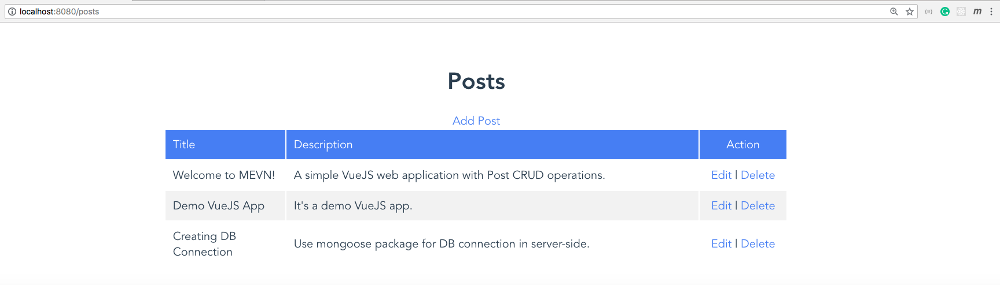
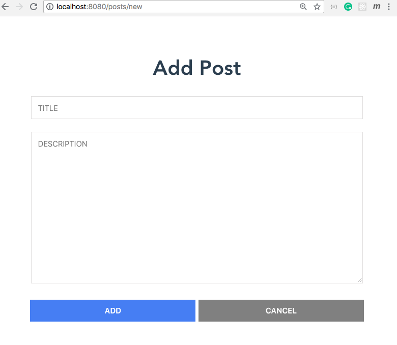
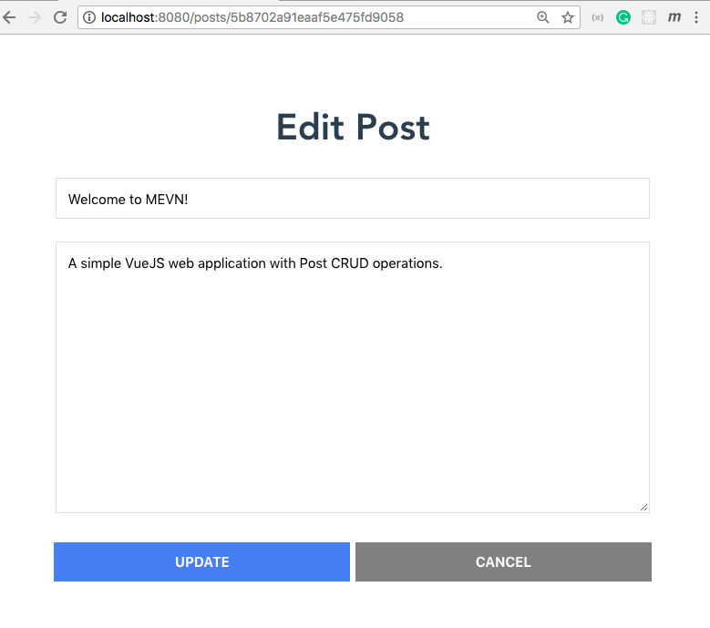

# Simple VueJS Web App by MEVN
This is a simple web application with basic CRUD operations for posts built on **MEVN**.

## Installation
1. Download or clone this repo.
2. Run `$ npm install` under `server` and `client` folders.
3. Make sure to run the MongoDB locally.
4. Start server: `$ cd server && npm start`
5. Start client: `$ cd client && npm run dev`
6. Navigate to `http://localhost:8080/posts`

## Screenshots

